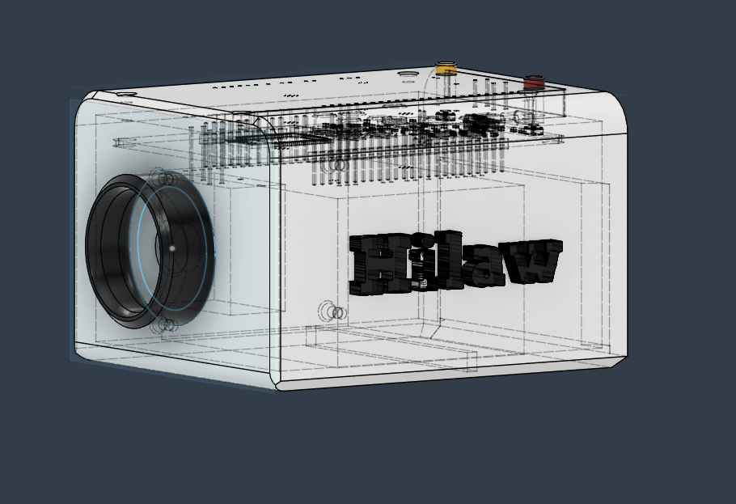

| Date started: July 7, 2025

Total hours spent: 54 hours

# Entry #0 - 07-07-25

Research on the components

So for this entry, I've been mainly just going around scouting components
in digikey.

Here are some obsidian notes:

Project Making - Building your own Instax Camera - 07-05-25

Project Name: Hilaw

Features:
- OLED screen preview (Hybrid between digital and analog)
	- Allow users to choose when to print it
- Press a button -> take a pictures
- Adjust settings
- Storage (SD Card)
- Processing on a thermal printer
- Power
	- Latching circuit
	- USB-C w SD CARD

Parts needed:
- ArduCAM
- TFT LCD
- Thermal Printer
- MCU (ESP BOARD SERIES)
	- ESP-32-S3
- Power system

Components - Camera Module - 07-07-25

Characteristics
- Megapixels
	- Megapixels are usually a metric for cropping
	- Basically, if you crop something, it will still retain its quality 

What makes a better image quality?
- Attributed to lower noise
- Better colours
- Dynamic Range

Great camera modules:
- ESP32-CAM

The good thing about ESP32-CAM:
- Cost-effective
- Doesn't take too much dev time
- Fits right perfectly
- Option to be coded with the ESP board series

Cons of ESP32-CAM:
- Video streaming wasnt the best
	- The resolution wasnt the best

Comparing this with the Raspberry Pi Cam V2
- RP
	- Image quality - much better due to SONY sensor
	- 8 MP

Why is the ESP32-CAM stitll much better?
- Its compact and wireless
- Not that complex for this project

For this project, I would pick a camera that is:
- Plug and play, fast *development*
- Has the bare minimum
- Doesn't have to have manual image control

Ends there

Total hours spent: 5 hours

# Entry #1 - 07-19-25 - Researching more components

You guessed it! More research!

What is thermal printing?
- Imagine the receipts, thermal printing is used to print those

By using the same principle of thermal printers, we can:
- Print instantly using heat

Cons of thermal printing
- They start to fade away
- Depends on paper

Thermal Printer vs Inkjet
- Inkjet
	- Paper jam
- Thermal Printers
	- Embedded Thermal Printer V2.0

Components - LCD vs OLED Screen - 07-07-25

Feature focused on: Preview of the camera's printed image

What is OLED?
- Display technology that exhibits amazing contrast since the pixels turn off to display black
- Composed of organic material that emits light when an electric current is applied

LCD
- Utilizes a backlight that shines through liquid crystals to create an image
- Control the amount of light that passes through, dictating the color and brightness of pixels

Benchmarks

Contrast ratio and black levels
- OLED technology outshiens LCD when it comes to this
- Each pixel on the OLED screen is independently lit,

LCD
- On the other hand, LCDs, regardless of backlight technology used, always emit some level of light even when trying to display black, leading a lower contrast ratio

Lifespan and Burn-in
- LCD displays are not susceptible to these issues
- OLED
	- The organic materials in OLED dipslays can degrade over time
	- Moreover, if static images are displayed for extended periosd, OLED screens can suffer from burn-in
		- Where ghost images are permanently imprinted in the screens

Energy Efficiency
- Another area where LCDs tend to excel
	- Generally consume less power than OLEDs when displaying bright or white backgrounds
	- However, the same cannot be said when dark or black images are on the screen as OLEDs consume less power 

Conclusion: 
- We're gonna use a TFT LCD
	- Difference between a TFT LCD and a normal one is that its much more robust (TFT LCD) due to new technology

Total hours spent: 5 hours

# Entry #2 - 07-22-25 - Researching Power Electronics & Doing the Schematic

For this entry, I've started doing the schematic. I only focused on making this a power only PCB, and I focused the most on getting the power part to work so I can work with the PCB straight away.

Here is another peek of my obisdian note for power calculations:

ESP32-WROOM-32 Power Characteristics:
- Power supply voltage -> -0.3V - 3.6V (absolute max)
- Minimum power supply current -> >= 500mAh
- Probably 800mAh to accomodate for the other components

ILI9341 LCD Characteristics (TFT LCD)
- Supply voltage (Logic): 3.3V (Absolute maximum characteristic)
- Around 100mA

ARDUCAM (Camera sensor)
- Supply voltage: 3.3V to 5V
- Peak current (Working): 154mA

Thermal Printer (DF Robot Embedded printer)
- Working voltage: 9V
- Working current: 1.5A - 2A when printing

What to do:
- Since the thermal printer requires a lot more power than the other components, the power system's  requirements would have to be:
	- Battery capacity: 2Ah with discharge rate of 2C 
		  discharge rate is important because it dictates the rate of which it delivers electrical energy
		  That basically means the speed of which it discharges the current we need
		  So lets say we had a 1Ah battery but the charge is only 0.5C, well that would only deliver 500mA

Basic principle of boost converter:
- Boost converters do not boost current, they boost voltage at the expense of current
- Basic principle:
	- V in  * I in = V out * Iout

Total hours spent: 6 hours

# Entry #4 - 07-24-25 - Finishing up the schematic for power management

In this journal, I mainly polished up the schematic. I've been reading a lot of datasheets and been scrolling thru a lot of them, just to make sure I don't  get anything wrong.

Here's the final schematic (Power management only since this PCB is for that)

Also, I've gotten a jumpstart at the PCB. Its been in the making currently. Didn't get any pictures sadly, forgot em.

Total hours spent: 6 hours

# Entry #5 - 07-25-25 - Finishing the PCB Layout for power management

In this entry, I have finished up the PCB layout. Here is how it looks:

Also, I've gotten a jumptart of the CAD. I've been mainly thinking about how to fit all of these components. For example, how would I fit the PCB, thermal printer, and Arducam inside it?

Also, I've been brainstorming what the hell do I do with the buttons. I heard its great to have a square on top of the tactile switch with 0.5mm clearance. so I did that on top of the circular model of the button. I did that for both buttons! Power and shutter, which have self-explanatory usages for cameras.

Total hours spent: 8 hours

# Entry #6 - 07-26-25 - Finishing up the CAD 

I've been experimenting with how to mount the PCB so that it is stable throughout the usage of the PCB. I decided to go for screws with the standoffs so it doesnt fall on the ceiling of the CAD.

Aaaandd... here is what the final CAD looks like! I decided to make this super simple. I didn't want it to be that designy, since I just wanted to use this

Here is what it looks like:

total hours spent: 6 hours

# Entry 7 - 07-29-25 - Ordering PCB & Other Stuff

For this entry, I've ordered most of what I need to assemble this!

- ✔️ PCB
- ✔️ Thermal Printer
- ✔️ Camera (albeit, differnet one since budget didn't reach)

See pictures:

Total hours spent: 1 hour

# Entry 8 -  07-31-25 - Working with the firmware 

For this entry, I've decided to get a jumpstart on the firmware. 

I mainly got to the initialization part of all components working. For instance, making the camera's initial process work, and the TFT display's display screen to be able to display something.

Besides that, I've also been doing a ton of research on how to make this work, and I think I've got an idea on how to.

Total hours spent: 3 hours

# Entry 9 - 08-01-25 - More Firmware Loading...

Yep! So for this session, I just mainly wanted to work on the firmware.

I specifically worked on polishing the shutter button's logic, and about how to convert the OV2640's logic to a RGB Bit Depth Data for the TFT display to interpret, hence streaming it on the display.

Well, for streaming, it is quite WIP for now. 

Total hours spent: 1 hour

# Entry 10 - 08-10-25 - All stuff arrived & Assembling prototype

Yay! So for this session, the parts have officially arrived (all of em).

So once that happened, I decided to go and assemble the prototype with the right connections. I planned to connect all the connections first with jumper wires first and then we can test out that firmware.

Total Hours spent: 2 hours

# Entry 11 - 08-12-25 - Finishing up the PCB assembly and checking connections

Yep! Did some PCB assembly and some checking of connections.

Huh, but for some odd reason, why isn't my battery working? To be exact, when I connect the battery to the JST connector, why do I not get any readings from the pads of the JST connector? 

Some things I've tried:
- Check if the battery is dead, which is not.
- Check for proper crimping of the connector (yep it is. Otherwise, how would've I be able to probe it inside of the jst connector of the battery.)
- Tested for continuity between the red metal wire of the battery and the PCB pad of where the power source is supposed to go. Still didn't work
- As mentioned in the fourth bullet point, I also tried it for the GND metal wire, same outcome.

I have no idea exactly why this is happening. It should be a simple plug and play yet what I'm experiencing is something very weird and unusual. Perhaps there's something wrong with the orientation? I did tell JLCPCB to assemble the JST connector on the PCB board upside down (180 degrees), which shouldn't change how it should be. The footprint still is exactly how it is on the PCB.

Whatever it is, I'll try to solve it.

Total hours spent: 2 hours

# Entry 12 - 08-13-25 - Finished up the firmware and testing it!

Yep! So for this entry, I've managed to finish the firmware.

Here are the things I've implemented:
- Implemented a video of each frame to display on the TFT display.
- Being able to display that picture at the end
- Implemented and set up the thermal printer
- Converting the RGB565 data into a bitmap for the printer to print
- Polished the initialization part on some stuff

Here's my favorite line of code(s) :D:

Here are also some obsidian notes of the things I've learnt:

What is a RGB Bit Depth Map?
- 2D grayscale images of the same size as the RGB images they are associated with
- The gray level of each pixel of the depth map indicates the distane to the camera of its corresponding RGB Pixel
Turning a RGB Bit Depth Map into a video for the camera
- In order to tur nthe RGB Bit depth map into a video camera, we simply just need to put a while loop to loop through each frame
- Of course, we need to add a delay in order to calculate for a certain FPS so that we may not overwhelm the MCU
Basics of converting RGB565 data to its bitmap version:
- Pixels
	- The atoms of the image, "picture element" which is the smallest dot of an image
	- Each pixel stores color information
	- Ex:
		- RGB565 ->  16 bits per pixel (5 red, 6 green, and 5 blue)
		- Monochrome 1-bit -> 1 bit per pixel
- Bitmap
	- "The map of pixels"
	- A bitmap is an array of pixel data laid out in memory, usually from left to right, top to bottom
	- Each row is a scanline
	- 8 pixels -> 1 byte
So for turning the RGB data into a bitmap version:
- Initialize the bitmap as an array of unsigned 8 bit integers using the dimensions of the picture
- For each x and y bit of that picture, convert the RGB565 data into a monochrome pixel
- Afterwards,   unpack RGB565 into its individual R, G, and B components
- Measure the brightnenss (luminance) of each component
- Use conditionals to set it up for a white or a black pixel by going to each byte and getting each bit's position to manipulate the bits value

Now, moving onto the testing, I found out that the reason why the battery wouldn't provide any power.

I forgot to check DRC and rushed submitting this. Welp, time to cut that trace!

Total hours spent: 5 hours

# Entry 13 - 08-14-25 - Cutting the Trace and finding the short circuits

For this entry, yes, I was able to cut that trace and was able to test continuity just fine.

However, another problem came up.... how come theres still a short circuit between GND and my power rail? I tried searching for it but to no avail.

It's just so hard to honestly pinpoint where the shortcircuit truly happened. There's too many factors to consider.

Total hours spent: 3 hours