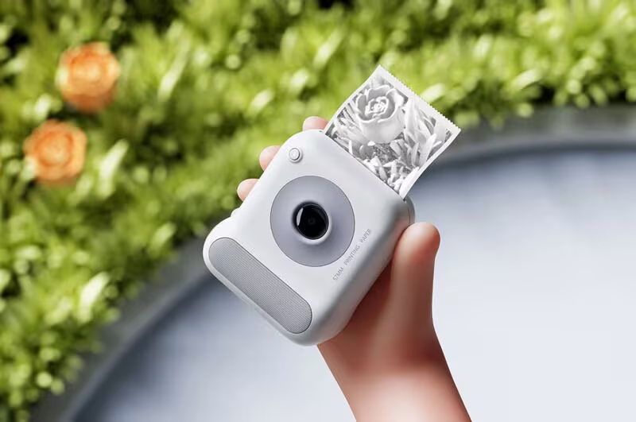
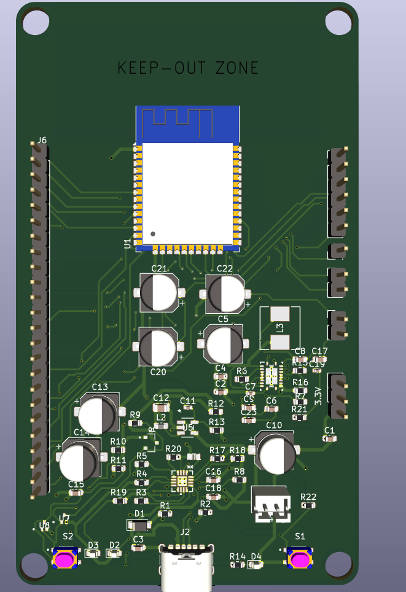
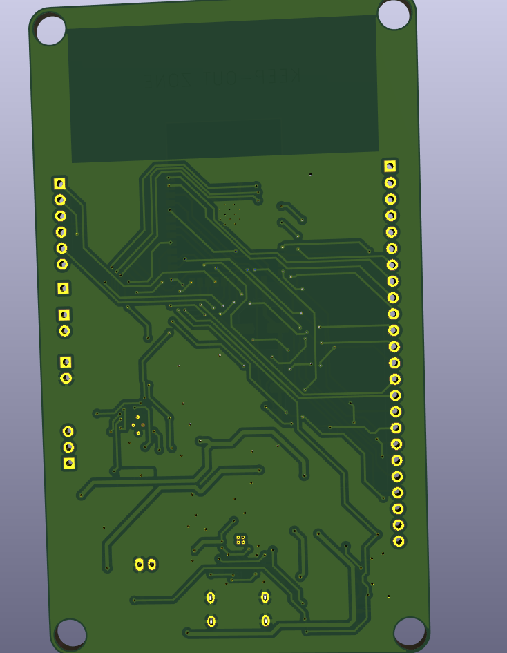
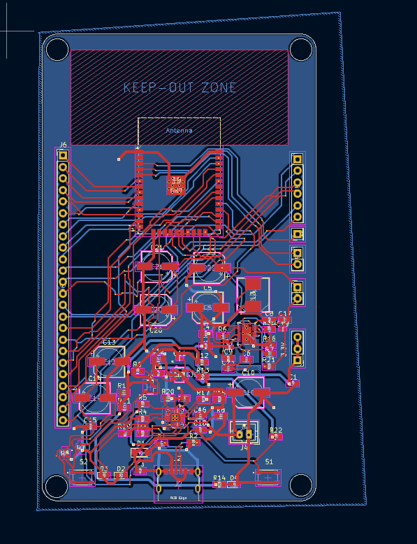
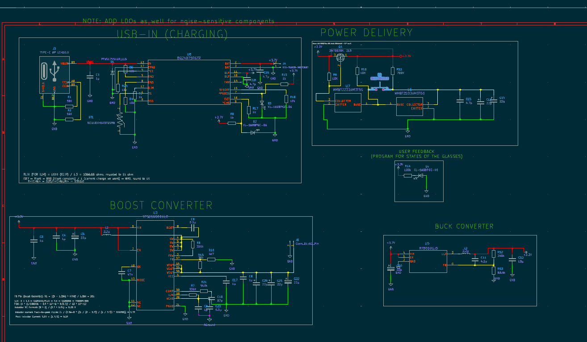
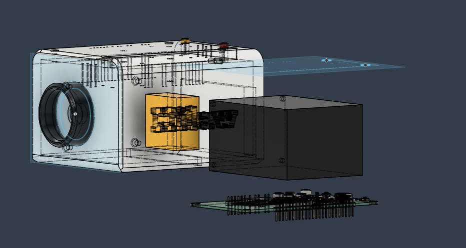
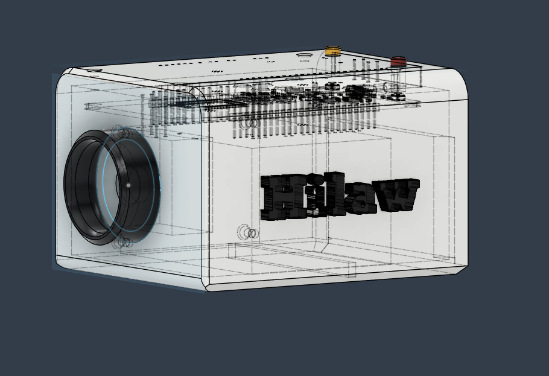
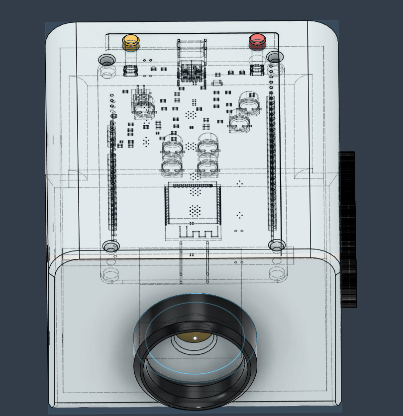
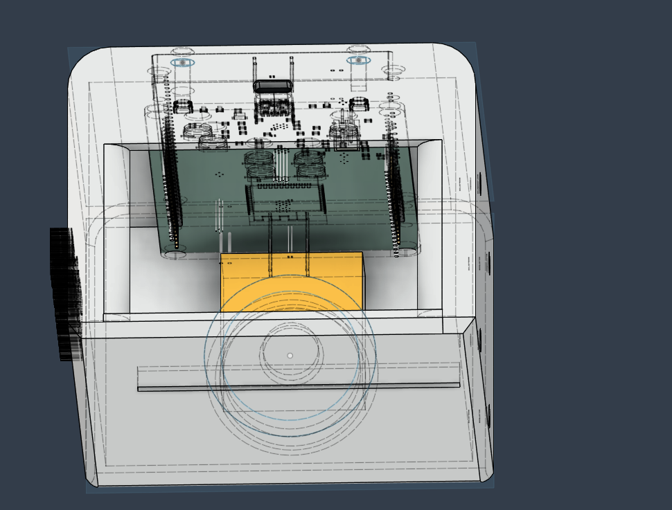

# Hilaw (3D Printed Instant Camera)

## Project Aims

Hilaw, in english, Raw, is a hybrid analog & digital camera used for taking personal pictures in order to preserve memories. 

Before snapping a picture, a sample image will pop up in the TFT display, having a preview unlike traditional polaroid cameras. Then, using an Arducam module as the camera sensor, it is able to capture images with of high quality.

Afterwards, logic is sent to the thermal printer to print that picture instantly. In the long term, using a thermal printer with sticker paper (I want to be able to stick my memories), will be very cost-effective than traditional film paper, albeit only white and black colors will be in the picture when printing.

Image 1. Concept of the project
Courtesy of [TrendHunter](https://www.trendhunter.com/trends/thermal-print-camera)

## Power Management PCB

Image 2. Top view of PCB

Image 3. Bottom view of PCB

## Layout & Schematic

Image 4. PCB Layout & Connections 

Image 5. Power Schematic of the PCB

P.S. The PCB was mainly used for creating a power management module just for this. The rest are pretty much built-in modules to buy.

## CAD

Image 6. Exploded View of the CAD

Image 7. Side View of the CAD

Image 8. Top view of the CAD

Image 9. Bottom View of the CAD

## 3D Printing
In terms of 3D Printing this project, I will print this in Resin since some of these are curved (also the lens cutout is circular). You may print this in Resin with the following parameters:

Layer height: 0.05mm

Orientation: 30-45 degrees

thats pretty much it 

## BOM
[View the bom](BOM.csv)

## Firmware
Have not yet started on the firmware. I am going to choose the Arduino IDE in order to program the ESP32-WROOM-32 since it is much more convenient for prototyping.